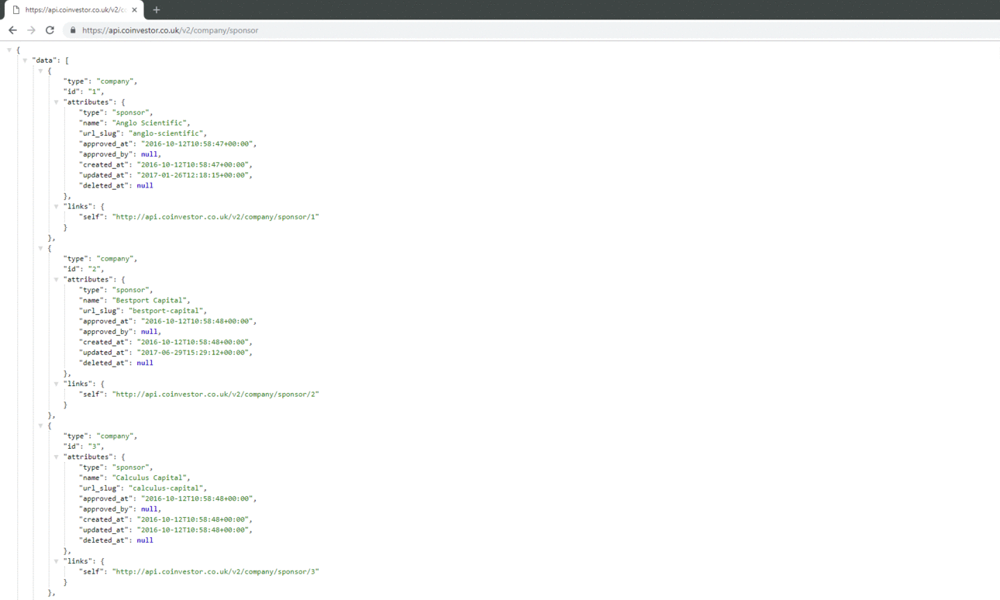
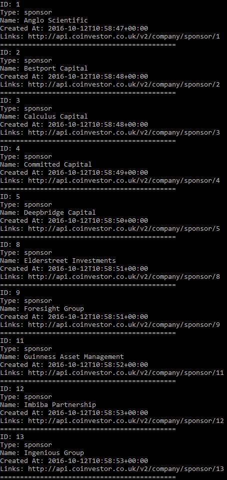

# Web-Api-to-C-Sharp

### This C# demo makes a Http client request from a Web API to a company called Coinvestor who is based in Canterbury, converts the data into C# objects and prints out the results on the console.

```
## To view the API in your browser **[CLICK HERE](https://api.coinvestor.co.uk/v2/company/sponsor)**

```

```
## The Result printed in the Console..

```